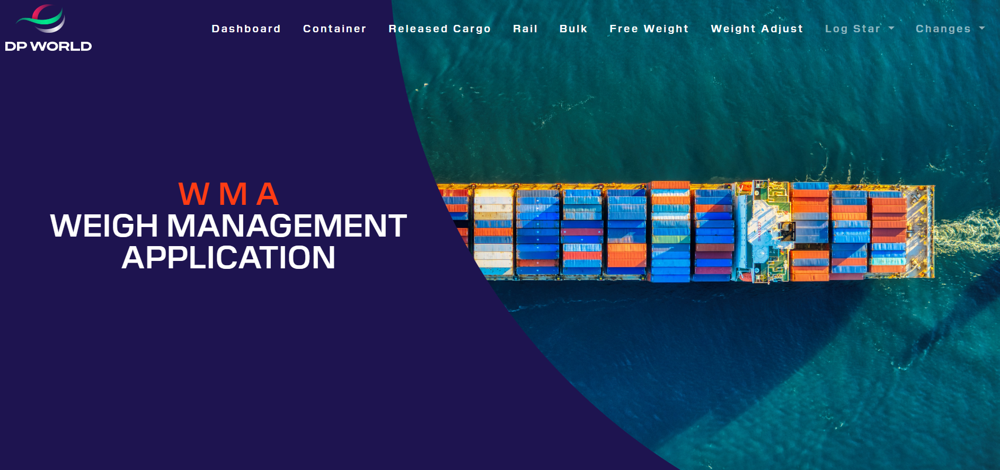

#  WMA-DP-Project
> It is a ( Weight Management Project ) related DP World Company in my internship there , it was about to change the system and turn it
  from disktop to website 

## Table of Contents

* [Technologies Used](#technologies-used)
* [Features](#features)
* [Screenshots](#screenshots)
* [Samples of Old version and New Version](#screenshots)
* [Project Status](#project-status)

## Technologies Used
- Front End - HTML5 , CSS3 ,Bootstrap

 

## Features

- It Contains 11 pages
- Most of pages are long forms related to weigh management system for containers
- Full inputs for each  page

## Screenshots

## Project Status
Project is: _complete_ 

